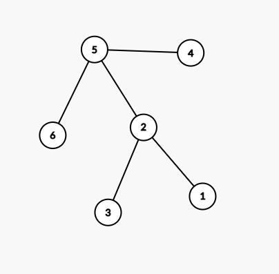

### Problema
> A Telephone Line Company (TLC) is establishing a new telephone cable network. They are connecting
several places numbered by integers from 1 to N. No two places have the same number. The lines
are bidirectional and always connect together two places and in each place the lines end in a telephone
exchange. There is one telephone exchange in each place. From each place it is possible to reach through
lines every other place, however it need not be a direct connection, it can go through several exchanges.
From time to time the power supply fails at a place and then the exchange does not operate. The
officials from TLC realized that in such a case it can happen that besides the fact that the place with
the failure is unreachable, this can also cause that some other places cannot connect to each other. In
such a case we will say the place (where the failure occured) is critical. Now the officials are trying to
write a program for finding the number of all such critical places. Help them

### Entendimento

O problema pede a quantidade de vértices que, ao serem removidos, desconectam outros vértices do grafo. Esses vértices são chamados de **vértices de articulação**.

### Modelagem

- **Vértices:** os lugares, numerados de 1 a _N_.
- **Arestas:** as linhas telefônicas que conectam dois lugares.

### Características do grafo
- Não direcionado
- Conexo (garantido pelo enunciado)
- Não ponderado
- Simples

### DFS/BFS

Precisamos verificar se, ao remover um vértice, os outros lugares continuam se alcançando. Para isso, usamos o **DFS**, pois o objetivo não é encontrar o menor caminho entre os lugares (caso em que o BFS seria mais indicado), e sim saber se ainda existe conexão.

### Entrada e Saída (Instância)
**Entrada**

A entrada consiste em diversos blocos (casos de teste). Cada bloco começa com a quantidade de lugares _N_. Em cada linha seguinte, o primeiro número é um lugar e os demais são os lugares diretamente conectados a ele. Uma linha contendo apenas `0` encerra o bloco, e um _N_ igual a `0` encerra a entrada.

> Como as linhas têm tamanho variável, a leitura deve ser feita linha a linha.

```
6
2 1 3
5 4 6 2
0
0
```
**Saída**

Para cada bloco, uma linha com a quantidade de lugares críticos (vértices de articulação).
```
2
```

No exemplo, os lugares críticos são **2** e **5**.

**Grafo:**

